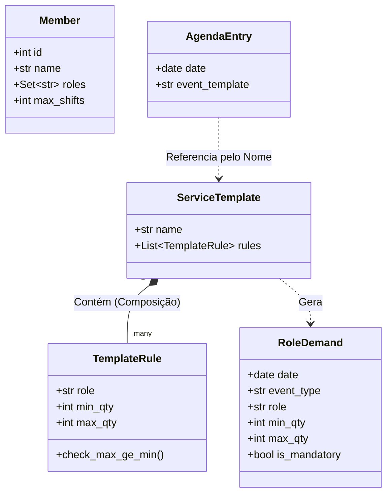

# WORSHIP SCHEDULER - PROJECT CONTEXT

## 1. Visão Geral

Sistema de otimização de escalas para equipas de louvor, focado em resolver conflitos complexos de disponibilidade, competência técnica e fadiga dos voluntários.

* **Stack:** Python 3.11+, Google OR-Tools (CP-SAT), Pandas, Pydantic.
* **Paradigma:** Constraint Satisfaction Problem (CSP) com Otimização Global (Single Solve).

---

## 2. Arquitetura e Fluxo de Dados

O sistema **não** resolve a escala dia-a-dia (abordagem gulosa). Ele carrega todas as restrições, normaliza os dados e resolve o período inteiro de uma só vez.

### Diagrama de Fluxo (Pipeline)

```mermaid
flowchart TD
    subgraph INPUTS [Arquivos CSV]
        A[templates_serviços.csv]
        B[cultos.csv]
        C[membros.csv]
        D[indisponibilidades.csv]
    end

    subgraph MEMORY [Estruturas em Memória]
        E[Dict: ServiceTemplate]
        F[List: AgendaEntry]
        G[List: Member]
        H[Set: Indisponibilidades]
    end

    subgraph PROCESS [Motor de Geração]
        I{Processador / Builder}
    end

    subgraph OUTPUT [Input do Solver]
        J[List: RoleDemand]
    end

    %% Ligações
    A -->|load_templates| E
    E -.->|Agrupa Regras por Culto| E
    
    B -->|load_schedule| F
    C -->|load_members| G
    D -->|load_unavailability| H
    
    F --> I
    E -->|Lookup Rápido O(1)| I
    
    I -->|Explode Template + Data + Custom| J

```

### Detalhes do Fluxo

1. **Input (CSVs):** O utilizador preenche os CSVs usando **Nomes** e datas (ISO ou formatos mistos `DD/MM/YYYY`).
2. **Loader (`src/loader.py`):**
* **Canonicalização (Fail-Fast):** Normaliza nomes (remove acentos, espaços, lowercase) para gerar um "Fingerprint". Se houver colisão (ex: "Ana Silva" e "Ana  Silva"), o sistema para imediatamente.
* **Validação de Datas:** Usa parsing robusto (`dayfirst=True`, `format='mixed'`) para garantir integridade.
* **Lookup Map:** Cria um mapa reverso `Fingerprint -> ID` para buscas .


3. **Solver (`src/solver.py`):**
* Recebe a lista plana de `RoleDemand`.
* Aplica Hard Constraints (Indisponibilidade, Competência, Unicidade, Janela Deslizante).
* Executa o `Solve()`.


4. **Output:** Gera a escala final traduzindo IDs de volta para Nomes.

---

## 3. Regras de Negócio (Constraints)

### Hard Constraints (Obrigatórias)

1. **Indisponibilidade:** Se o par `(id_membro, data)` estiver no `Set` de bloqueios, .
2. **Competência:** Um voluntário só assume funções listadas no seu perfil.
3. **Unicidade:** Um voluntário só pode exercer uma função por dia.
4. **Janela Deslizante (Rolling Window):** Para qualquer intervalo de 31 dias, a soma de escalas não excede `max_shifts`.

### Lógica de Cobertura (Hierarquia de Templates)

O sistema utiliza uma estrutura hierárquica para definir demandas:

* **ServiceTemplate:** O objeto "Pai" (ex: "Culto Domingo").
* **TemplateRule:** O objeto "Filho" (ex: "Domingo precisa de 1 Bateria").
* **RoleDemand:** O objeto final gerado para uma data específica.

Se houver `demandas_customizadas.csv`, a regra é: **"O Específico vence o Genérico"**. O Custom pode sobrescrever quantidades, adicionar instrumentos extras ou remover necessidades (setando `max_qty=0`).

---

## 4. Modelagem de Classes (UML)

A estrutura de dados utiliza **Pydantic** para validação forte de tipos e integridade lógica (ex: garantir que `max >= min`).



---

## 5. Estrutura de Arquivos e Inputs

Todos os ficheiros devem estar na pasta `data/`.

1. **`membros.csv`**: `id, name, roles, max_shifts`
* *Proteção:* Nomes similares geram erro de colisão na carga.


2. **`indisponibilidades.csv`**: `name, data`
* Carregado em memória como um `Set[Tuple[int, date]]` para performance máxima.


3. **`templates_serviços.csv`**: `event_template, role, min_qty, max_qty`
* Define a regra padrão. Agrupado em memória num `Dict[str, ServiceTemplate]`.


4. **`cultos.csv`**: `date, event_template`
* Define o calendário.


5. **`demandas_customizadas.csv`**: `date, role, min_qty, max_qty`
* Overrides pontuais.


---

## 6. Guia de Desenvolvimento

### `src/loader.py`

* Responsável pela **Segurança e Sanitização**.
* Implementa `get_canonical_key` para normalização de strings.
* Retorna `(List[Member], Dict[str, ServiceTemplate], Set[Indisponibilidade])`.
* Usa Pandas com `errors='coerce'` para validação robusta de datas.

### `src/model.py`

* Define os modelos **Pydantic**.
* `TemplateRule`: Valida se `max_qty >= min_qty` na leitura do CSV.
* `RoleDemand`: Objeto final imutável que alimenta o Solver.

### `src/solver.py`

* Responsável pela **Matemática**.
* Recebe dados limpos e validados.
* Não faz parse de arquivos, apenas resolve a matriz booleana.